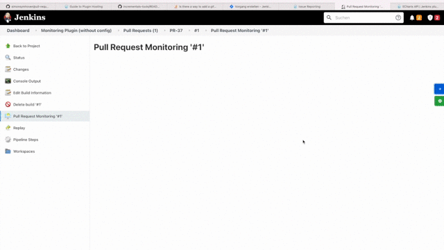
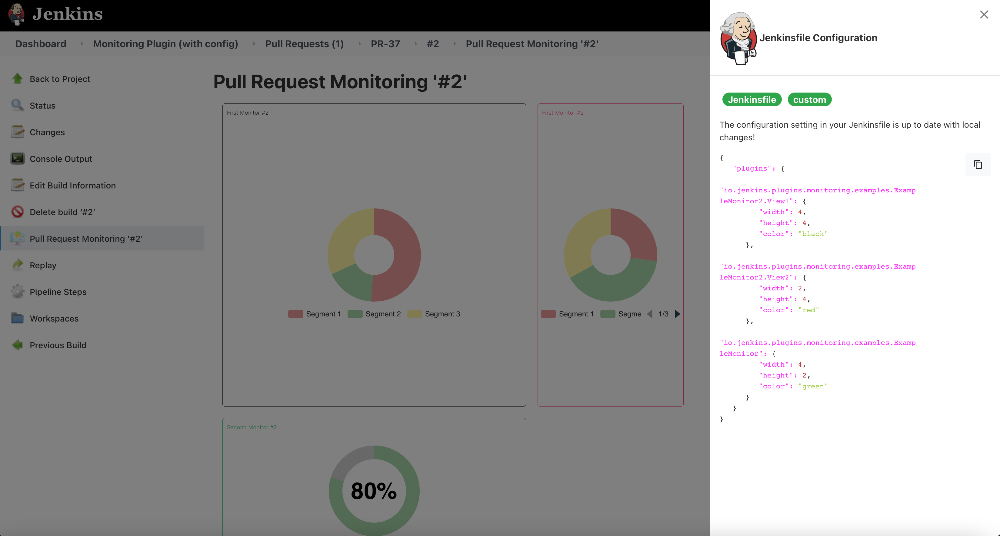

[](https://gitter.im/pull-request-monitoring-plugin/community?utm_source=badge&utm_medium=badge&utm_campaign=pr-badge&utm_content=badge)


[](https://app.codacy.com/gh/simonsymhoven/pull-request-monitoring-plugin?utm_source=github.com&utm_medium=referral&utm_content=simonsymhoven/pull-request-monitoring-plugin&utm_campaign=Badge_Grade_Settings)

<!-- PROJECT LOGO -->
<br />
<p align="center">
  <a href="https://github.com/simonsymhoven/pull-request-monitoring-plugin">
   
  </a>

  <h3 align="center">Pull Request Monitoring</h3>

  <p align="center">
    Jenkins plugin to monitor pull requests with a customizable dashboard.
    <br />
    <a href="https://github.com/simonsymhoven/pull-request-monitoring-plugin/blob/master/README.md"><strong>Explore the docs »</strong></a>
    <br />
    <br />
    <a href="https://github.com/simonsymhoven/pull-request-monitoring-plugin/issues">Report Bug</a>
    ·
    <a href="https://github.com/simonsymhoven/pull-request-monitoring-plugin/issues">Request Feature</a>
  </p>
</p>

<!-- TABLE OF CONTENTS -->
<details open="open">
  <summary><h2 style="display: inline-block">Table of Contents</h2></summary>
  <ol>
    <li>
      <a href="#about-the-project">About The Project</a>
      <ul>
        <li><a href="#built-with">Built With</a></li>
      </ul>
    </li>
    <li>
      <a href="#getting-started">Getting Started</a>
      <ul>
        <li><a href="#prerequisites">Prerequisites</a></li>
        <li><a href="#provide-a-view">Provide A View</a></li>
            <ul>
                <li><a href="#the-code-behind">The code behind</a></li>
                <li><a href="#the-corresponding-jelly-file">The corresponding jelly file</a></li>
            </ul>
      </ul>
    </li>
    <li><a href="#usage">Usage</a></li>
        <ul>
            <li><a href="#default-dashboard">Default Dashboard</a></li>
            <li><a href="#custom-dashboard">Custom Dashboard</a></li>
        </ul>
    <li><a href="#roadmap">Roadmap</a></li>
    <li><a href="#contributing">Contributing</a></li>
    <li><a href="#license">License</a></li>
    <li><a href="#credits">Credits</a></li>
    <li><a href="#contact">Contact</a></li>
  </ol>
</details>

## About The Project

Many software teams have changed their development processes to lightweight pull requests. 
Changes to the software are packed into such a pull request, 
which is then manually reviewed and also automatically built in the CI/CD server. 
In Jenkins, however, these pull requests are not "first-class citizens"; the results of a pull request 
are currently simulated via branches.

For developers, this representation is insufficient: instead of having Git diffs, tests, static analysis, etc. 
as an overview in the overall project, a filtered representation of these results on the changes actually made 
would be much more helpful.

This plugin offers a possibility to display and aggregate the results (in the form of individual views) of a pull 
request in a configurable dashboard. Views can only be accessed or displayed if the corresponding plugin fulfils 
certain requirements and already provides a view.

### Built With

*  [Muuri](https://github.com/haltu/muuri)

## Getting Started

### Prerequisites

Currently, only **multibranch pipelines** projects are supported to use this plugin. Therefore, you have to 
install the corresponding Jenkins plugin [Multibranch: Pipeline](https://plugins.jenkins.io/workflow-multibranch/) 
and connect to own of your SCM Repositories to use the **Pull Request Monitoring** Jenkins plugin.

### Provide a view

#### The code behind

The [MonitorView](src/main/java/io/jenkins/plugins/monitoring/MonitorView.java) interface defines the interface 
for each view that is to be displayed.
Each view needs at least one unique `id` and a `title`. In order to register the view for the plugin, 
a factory class is required, which must be provided with the annotation `@Extension`. 
The factory have to implement the [MonitorFactory](src/main/java/io/jenkins/plugins/monitoring/MonitorFactory.java) 
interface and delivers a set of `MonitorViews`.

A minimal example could look as follows:

```java
public class ExampleMonitor implements MonitorView {
    private final Run<?, ?> build;

    /**
     * Create a new {@link ExampleMonitor}.
     *
     * @param run
     *          the {@link Run}
     */
    public ExampleMonitor(Run<?, ?> run) {
        this.build = run;
    }

    @Override
    public String getTitle() {
        return "Example Monitor for build " + build.getDisplayName();
    }

    @Override
    public String getId() {
        return getClass().getName();
    }

    /**
     * Creates a new {@link ExampleMonitorFactory}.
     */
    @Extension
    public static class ExampleMonitorFactory implements MonitorFactory {
        @Override
        public Collection<MonitorView> getMonitorViews(Run<?, ?> build) {
            return Collections.singleton(new ExampleMonitor(build));
        }
    }
}
```

The factory can also deliver several views of a class, but please careful with the unique id of each view.

> **Unique View ID**:
> Usually the class name is used for the ID if only one view is delivered. If several views of the same class are created in the factory, it must be ensured that the ID is always unique!

Here is an example of a factory that delivers two instances of a class:

```java
/**
 * An example Monitor View.
 */
public class ExampleMonitor2 implements MonitorView {
    private final Run<?, ?> build;
    private final String id;

    /**
     * Create a new {@link ExampleMonitor2}.
     *
     * @param run
     *          the {@link Run}
     * @param viewId
     *          the id.
     */
    public First(Run<?, ?> run, String viewId) {
        this.build = run;
        this.id = viewId;
    }

    @Override
    public String getTitle() {
        return "Example Monitor 2 for build " + this.build.getDisplayName();
    }

    @Override
    public String getId() {
        return id;
    }
    
    /**
     * Creates a new {@link ExampleMonitor2Factory}.
     */
    @Extension
    public static class ExampleMonitor2Factory implements MonitorFactory {
        @Override
        public Collection<MonitorView> getMonitorViews(Run<?, ?> build) {
            List<MonitorView> monitors = new ArrayList<>();
            monitors.add(new ExampleMonitor2(build, "io.jenkins.plugins.monitoring.examples.ExampleMonitor2.View1"));
            monitors.add(new ExampleMonitor2(build, "io.jenkins.plugins.monitoring.examples.ExampleMonitor2.View2"));
            return monitors;
        }
    }
}
```

#### The corresponding jelly file

Each view have to have a corresponding `monitor.jelly` file, which is responsible for the content of the 
plugins view delivered on the dashboard later. Therefore you have to create a new `monitor.jelly` file 
in the directory, which corresponds to the `MonitorView` class. 

> **Example**: 
> The code behind is defined in `src/main/java/io/jenkins/plugins/sample/ExampleMonitor.java`. The related sources 
> (e.g. the `monitor.jelly` file) have to be defined in 
> `src/main/resources/io/jenkins/plugins/sample/ExampleMonitor/monitory.jelly`. 

Now the view, which can be added later in the dashboard, can be filled individually.
Of course, all obligatory functions of the Jelly files, such as [JEXL](https://commons.apache.org/proper/commons-jexl/) 
calls, can be used. To do this, please refer to the official Jenkins documentation.
A minimal example:

```xml
<?jelly escape-by-default='true'?>

<j:jelly xmlns:j="jelly:core">

    <p>Plugin content goes here!</p>

</j:jelly>
```

## Usage Of Monitoring

### Default Dashboard

To get an empty dashboard, add the following stage to your Jenkinsfile:

```
stage ('Pull Request Monitoring - Dashboard Configuration') {
    monitoring ( )
}
```

The dashboard will be added to each build, which corresponds to a pull request.
Now you are able to add plugins to the dashboard, change the layout or remove it again.
The configuration will be saved for each project locally. If you want to save the configuration permanently, 
it is best to copy and paste it into the Jenkinsfile and overwrite the default dashboard.



### Custom Dashboard

You can add your own pre-defined dashboard in the Jenkinsfile, e.g.:

```
stage ('Pull Request Monitoring - Dashboard Configuration') {
    monitoring (
        configuration:
        '''
        {
          "plugins": {
            "io.jenkins.plugins.monitoring.examples.ExampleMonitor2.View1": {
              "width": 4,
              "height": 4,
              "color": "black"
            },
            "io.jenkins.plugins.monitoring.examples.ExampleMonitor2.View2": {
              "width": 2,
              "height": 4,
              "color": "red"
            },
            "io.jenkins.plugins.monitoring.examples.ExampleMonitor": {
              "width": 4,
              "height": 2,
              "color": "green"
            }
          }
        }
        '''
 )
}
```

Therefore, each plugin needs at least the following keys:

```
    "<plugin-id>" : {
        "width": 1, 2, 3, 4 or 5,
        "height": 1, 2, 3, 4 or 5,
        "color": "green", "red", "black" or "blue"
    }
```

Then, if you open the build, the pre-defined plugins will be loaded:



## Roadmap

See the [open issues](https://github.com/simonsymhoven/pull-request-monitoring-plugin/issues) 
for a list of proposed features (and known issues).

## Contributing

Contributions are what make the open source community such an amazing place to be learn, 
inspire, and create. Any contributions you make are **greatly appreciated**.

1.  Fork the Project
2.  Create your Feature Branch (`git checkout -b feature/AmazingFeature`)
3.  Commit your Changes (`git commit -m 'Add some AmazingFeature'`)
4.  Push to the Branch (`git push origin feature/AmazingFeature`)
5.  Open a Pull Request

## License

Distributed under the MIT License. See [LICENSE](LICENSE) for more information.

## Credits

The following icons, which are used by this plugin 

*  [Line Graph Icon 32x32 px](src/main/webapp/icons/line-graph-32x32.png)
*  [Line Graph Icon 64x64 px](src/main/webapp/icons/line-graph-64x64.png)

made by [Freepik](https://www.freepik.com) from [Flaticon](https://www.flaticon.com/).

## Contact

Simon Symhoven - post@simon-symhoven.de

Project Link: [https://github.com/simonsymhoven/pull-request-monitoring-plugin](https://github.com/simonsymhoven/pull-request-monitoring-plugin)