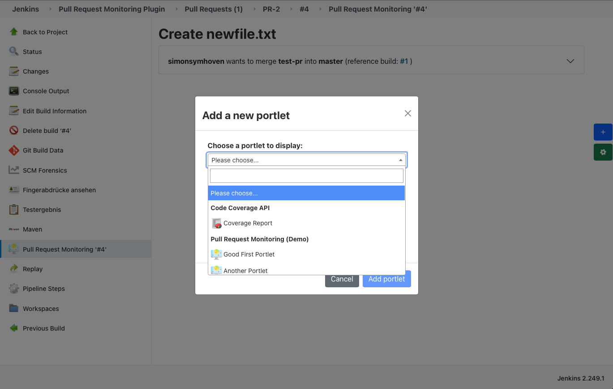
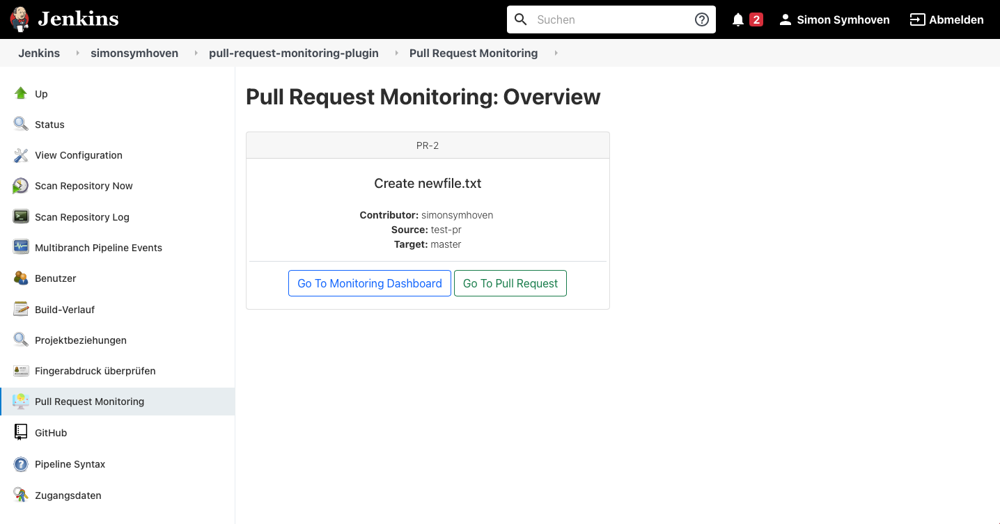

[](https://gitter.im/jenkinsci/pull-request-monitoring?utm_source=badge&utm_medium=badge&utm_campaign=pr-badge)


[](https://ci.jenkins.io/job/Plugins/job/pull-request-monitoring-plugin/job/master/)


[](https://codecov.io/gh/jenkinsci/pull-request-monitoring-plugin)
[](https://www.codacy.com/gh/jenkinsci/pull-request-monitoring-plugin/dashboard?utm_source=github.com&amp;utm_medium=referral&amp;utm_content=jenkinsci/pull-request-monitoring-plugin&amp;utm_campaign=Badge_Grade)

<!-- PROJECT LOGO -->
<br />
<p align="center">
  <a href="https://github.com/jenkinsci/pull-request-monitoring-plugin">
   
  </a>

  <h1 align="center">Pull Request Monitoring</h1>

  <p align="center">
    Jenkins plugin to monitor pull requests with a customizable dashboard.
    <br />
    <a href="https://github.com/jenkinsci/pull-request-monitoring-plugin/blob/master/README.md"><strong>Explore the docs »</strong></a>
    <br />
    <br />
    <a href="https://github.com/jenkinsci/pull-request-monitoring-plugin/issues">Report Bug</a>
    ·
    <a href="https://github.com/jenkinsci/pull-request-monitoring-plugin/issues">Request Feature</a>
  </p>
</p>

At the [Jenkins UX SIG Meeting](https://www.youtube.com/watch?v=F1ISpA7K0YA) on 28. April 2021, there was a live demo of the first beta version (1.0.3-beta).

<!-- TABLE OF CONTENTS -->
<details open="open">
  <summary><h2 style="display: inline-block">Table of Contents</h2></summary>
  <ol>
    <li>
      <a href="#about-the-project">About The Project</a>
      <ul>
        <li><a href="#built-with">Built With</a></li>
      </ul>
    </li>
    <li>
      <a href="#getting-started">Getting Started</a>
      <ul>
        <li><a href="#prerequisites">Prerequisites</a></li>
        <li><a href="#provide-a-portlet">Provide A Portlet</a></li>
            <ul>
                <li>
                <a href="#the-code-behind">The Code behind</a>
                <ul>
                    <li><a href="#one-instance-of-one-portlet">One Instance Of One Portlet</a></li>
                    <li><a href="#multiple-instances-of-one-portlet">Multiple Instances Of One Portlet</a></li>
                </ul>
                </li>
                <li><a href="#the-corresponding-jelly-file">The corresponding jelly file</a></li>
            </ul>
      </ul>
    </li>
    <li><a href="#usage">Usage</a>
        <ul>
            <li><a href="#">Introduction</a></li>
            <li><a href="#project-level">Project Level</a></li>
            <li><a href="#build-level">Build Level</a></li>
            <ul>
                <li><a href="#persistence-&-permissions">Persistence & Permissions</a></li>
                <li><a href="#default-dashboard">Default Dashboard</a></li>
                <li><a href="#custom-dashboard">Custom Dashboard</a></li>
                <li><a href="#settings">Settings</a></li>
            </ul>
        </ul>
    </li>
    <li><a href="#demo">Demo</a>
    <li><a href="#roadmap">Roadmap</a></li>
    <li><a href="#contributing">Contributing</a></li>
    <li><a href="#license">License</a></li>
    <li><a href="#credits">Credits</a></li>
    <li><a href="#contact">Contact</a></li>
  </ol>
</details>

## About The Project

Many software teams have changed their development processes to lightweight pull requests. 
Changes to the software are packed into such a pull request, 
which is then manually reviewed and also automatically built in the CI/CD server. 
In Jenkins, however, these pull requests are not "first-class citizens"; the results of a pull request 
are currently simulated via branches.

For developers, this representation is insufficient: instead of having Git diffs, tests, static analysis, etc. 
as an overview in the overall project, a filtered representation of these results on the changes actually made 
would be much more helpful.

This plugin offers a possibility to display and aggregate the results (in the form of individual views) of a pull 
request in a configurable dashboard. Views can only be accessed or displayed if the corresponding plugin fulfils 
certain requirements and already provides a view.

### Built With

*   [Muuri](https://github.com/haltu/muuri) wrapped in [Jenkins Muuri.js API Plugin](https://github.com/jenkinsci/muuri-api-plugin)
*   [Select2](https://select2.org) wrapped in [Jenkins Select2.js API Plugin](https://github.com/jenkinsci/select2-api-plugin)

## Getting Started

### Prerequisites

Currently, only **multibranch pipelines** projects are supported to use this plugin. Therefore, you have to 
install the corresponding Jenkins plugin [Multibranch: Pipeline](https://plugins.jenkins.io/workflow-multibranch/) 
and connect to own of your SCM Repositories to use the **Pull Request Monitoring** Jenkins plugin. 

### Provide a portlet

This plugin relies on other plugins to provide a view that aggregates and provides delta metrics for a pull request.

#### The code behind

The [MonitorPortlet](src/main/java/io/jenkins/plugins/monitoring/MonitorPortlet.java) interface defines the interface 
for each portlet that is to be displayed. In order to register the portlet for the plugin, 
a factory class is required, which must be provided with the annotation `@Extension`. 
The factory have to implement the [MonitorPortletFactory](src/main/java/io/jenkins/plugins/monitoring/MonitorPortletFactory.java) 
interface, receives the current `Run<?,?>`, delivers a set of `MonitorPortlets` and defines a `displayedName`, 
which appears as `optgroup` in the dashboard in the dropdown list of all available portlets and their corresponding 
factory.



##### One Instance Of One Portlet

Normally, one plugin delivers one portlet. The id has A minimal example could look as follows:

```java
import io.jenkins.plugins.monitoring.MonitorPortlet;

/**
 *  An example Monitor Portlet implementation with one portlet delivered by factory.
 */
public class ExamplePortlet implements MonitorPortlet {
    private final Run<?, ?> build;

    /**
     * Create a new {@link MonitorPortlet}.
     *
     * @param run
     *          the {@link Run}
     */
    public MonitorPortlet(Run<?, ?> run) {
        this.build = run;
    }

    /**
     * Defines the title of portlet. It will be shown in the 
     * upper left corner of the portlet.
     *
     * @return
     *          the title as string.
     */
    @Override
    public String getTitle() {
        return "Example Portlet";
    }

    /**
     * Defines the id for the portlet.
     *
     * @return
     *          the id.
     */
    @Override
    public String getId() {
        return "example-portlet-id";
    }

    /**
     * Defines the preferred width of the portlet. It's 
     * possible to override the default width by user.
     *
     * @return
     *          the width as int. (range from 100 to 1000)
     */
    @Override
    public int getPreferredWidth() {
        return 300;
    }

    /**
     * Defines the preferred height of the portlet. It's 
     * possible to override the default height by user.
     *
     * @return
     *          the height as int. (range from 100 to 1000)
     */
    @Override
    public int getPreferredHeight() {
        return 200;
    }

    /**
     * Defines the icon, which will be shown in the dropdown of 
     * all available portlets in the dashboard.
     *
     * @return
     *          the icon url as {@link java.util.Optional} of string, or an
     *          empty Optional, if a default icon should be added.
     */
    @Override
    public Optional<String> getIconUrl() {
        return Optional.of("</path-to-icon/icon.png>");
    }

    /**
     * Defines a link to a detail view, if its needed. Links the title
     * of the portlet to this url.
     *
     * @return
     *          {@link java.util.Optional} of the url, or an empty Optional,
     *          if no link should be provided by portlet.
     */
    @Override
    public Optional<String> getDetailViewUrl() {
        return Optional.of("<link-to-detail-view>");
    }

    /**
     * Creates a new {@link ExamplePortletFactory}.
     */
    @Extension
    public static class ExamplePortletFactory implements MonitorPortletFactory {
        @Override
        public Collection<MonitorPortlet> getPortlets(Run<?, ?> build) {
            return Collections.singleton(new ExamplePortlet(build));
        }

        @Override
        public String getDisplayName() {
            return "Example Portlet Factory";
        }
    }
}
```

#### Multiple Instances Of One Portlet

The factory can also deliver several portlets of one class.

> ⚠️ WARNING: **Unique portlet ID**:
> The id must be unique. Please make sure that the id is related to the plugin so that there are no conflicts with 
> other plugins. It is recommended to use the artifact id of the plugin or parts of it as suffix.
> If several portlets of the same class are created in the factory, it must be ensured that the ID is always unique 
> for each portlet!

Here is an example of a factory that delivers two instances of a class:

```java
/**
 * An example Monitor Portlet implementation with multiple portlets delivered by factory.
 */
public class ExamplePortlet implements MonitorPortlet {
    private final Run<?, ?> run;
    private final String id;

    /**
     * Create a new {@link ExamplePortlet}.
     *
     * @param run
     *          the {@link Run}
     * @param id
     *          the id.
     */
    public ExamplePortlet(Run<?, ?> run, String id) {
        this.run = run;
        this.id = id;
    }

    @Override
    public String getTitle() {
        return "Example Portlet " + getId();
    }

    @Override
    public String getId() {
        return id;
    }
    
    // other interface methods, see example above. 
    
    /**
     * Creates a new {@link ExamplePortletFactory}.
     */
    @Extension
    public static class ExamplePortletFactory implements MonitorPortletFactory {
        @Override
        public Collection<MonitorPortlet> getPortlets(Run<?, ?> build) {
            List<MonitorPortlet> portlets = new ArrayList<>();
            portlets.add(new ExamplePortlet(build, "example-portlet-first"));
            portlets.add(new ExamplePortlet(build, "example-portlet-second"));
            return monitors;
        }

        @Override
        public String getDisplayName() {
            return "Example Portlet Factory";
        }
    }
}
```

#### The corresponding jelly file

Each portlet have to have a corresponding `monitor.jelly` file, which is responsible for the content of the 
plugins portlet delivered on the dashboard later. Therefore you have to create a new `monitor.jelly` file 
in the directory, which corresponds to the `MonitorView` class. 

> **Example**: 
> The code behind is defined in `src/main/java/io/jenkins/plugins/sample/ExamplePortlet.java`. The related sources 
> (e.g. the `monitor.jelly` file) have to be defined in 
> `src/main/resources/io/jenkins/plugins/sample/ExamplePortlet/monitory.jelly`. 

Now the portlet, which can be added later in the dashboard, can be filled individually.
Of course, all obligatory functions of the Jelly files, such as [JEXL](https://commons.apache.org/proper/commons-jexl/) 
calls, can be used. To do this, please refer to the official Jenkins documentation.
A minimal example:

```xml
<?jelly escape-by-default='true'?>

<j:jelly xmlns:j="jelly:core">

    <p>Portlet content goes here!</p>

</j:jelly>
```

## Usage Of Monitoring

### Introduction
This plugin offers the following monitoring options:

*   project level: [MonitoringMultibranchProjectAction](src/main/java/io/jenkins/plugins/monitoring/MonitoringMultibranchProjectAction.java)
*   build level: [MonitoringBuildAction](src/main/java/io/jenkins/plugins/monitoring/MonitoringBuildAction.java)

### Project Level

The monitoring on the project level is very basic and is limited to the summary of all open pull requests of the associated SCM.
From here, you can access the corresponding monitoring dashboards, view the pull request information and navigate
to the respective pull request in the repository.



### Build Level

The monitoring at build level is the core of the plugin and offers the possibility 
to observe various delta metrics of a pull request provided by other portlets.

The dashboard is only added to those builds whose branch 
[SCMHead](https://javadoc.jenkins.io/plugin/scm-api/jenkins/scm/api/SCMHead.html) of the parent job is an instance of 
[ChangeRequestSCMHead](https://javadoc.jenkins.io/plugin/scm-api/jenkins/scm/api/mixin/ChangeRequestSCMHead.html).
Otherwise, the corresponding [MonitoringBuildAction](src/main/java/io/jenkins/plugins/monitoring/MonitoringBuildAction.java) 
will not be added and no dashboard will be provided for the build.
For more details, please refer to the logging in the console output of the respective build.

#### Persistence & Permissions

The configuration, which is set via the Jenkinsfile or via the Dahsboard, is saved per user as a 
`hudson.model.UserProperty` and is browser independent. The plugin therefore requires that you are logged in 
and have the appropriate permissions. Otherwise, the action will not be displayed! 

#### Default Dashboard

To start with an empty dashboard, there are two ways, which are provided by the plugin:

1.  Do nothing. If the run is part of a pull request, the corresponding 
    [MonitoringDefaultAction](src/main/java/io/jenkins/plugins/monitoring/MonitoringDefaultAction.java) is automatically 
    added to the `Run` and later available on the sidepanel of the run. 
   
2.  Another to get an empty dashboard, add the following stage to your Jenkinsfile:
    It is recommended to add the monitoring at the end of your pipeline, to ensure that other
    plugins such as static code analysis are performed first and that the actions that may be required are
    available.
    ```text
    stage ('Pull Request Monitoring - Dashboard Configuration') {
        monitoring ( )
    }
    ```

The dashboard will be added to each build, which corresponds to a pull request.
Now you are able to add plugins to the dashboard, change the layout or remove it again.
The configuration will be saved for each project per user. If you want to save the configuration permanently, 
it is best to copy and paste it into the Jenkinsfile and overwrite the default dashboard and use a custom dashboard.

#### Custom Dashboard

The other way to add a dashboard is to set the configuration of the dashboard via the Jenkinsfile to pre-define
your dashboard:

```text
stage ('Pull Request Monitoring - Dashboard Configuration') {
    monitoring (
        portlets:
        '''
        [
            {
                // Minimal usage of one portlet 
                "id": "portlet-id"
            }, 
            {   
                // Feel free to customize the portlets
                "id": "another-portlet-id",
                "width": 200,
                "height": 100,
                "color": "#FF5733"
            }
        ]
        '''
 )
}
```

Therefore, the monitoring stage expects a JSONArray of JSONObjects. To validate your
configured json, you could use a [JSON Schema Validator](https://www.jsonschemavalidator.net) and the 
corresponding [JSON schema](src/main/resources/schema.json) used for this plugin. 
Each JSONObject needs at least the `id` of the portlet to add. For `width` and `height`, the default 
`referredWidth` and `preferredHeight` of the `MonitorPortlet` is used. `#000000` is used as default `color`. 

The dashboard will be added to your `Run` and the pre-defined monitor should be available. 

> ⚠️ WARNING: **Duplicate or missing portlet IDs**:
> Duplicates will be removed as well as missing portlet ids. The `Run` will not fail unless 
> the provided json does not follow the scheme!

If there are unavailable portlets (e.g. corresponding plugin is uninstalled) in stored user configuration, 
and the dashboard tries to load this portlet, an alert will be displayed with the ids of the unavailable portlets:


#### Settings

Under the settings of each `Run`, various things can be tracked:

1.  Are there changes of the pre-defined dashboard since the last build?
2.  The current activated source of configuration (Default or User-specific).
    * Default means Jenkinsfile if `monitoring` is provided, else and empty JSONArray.
    * User-specific means the local changed of dashboard.
3.  Configuration synced with the default one? If needed, you can synchronize the
    actual configuration with the default one.
4.  The actual configuration
5.  The default configuration.

> ⚠️ WARNING: **Prioritising of the different configurations:**:
> If there is a user-specific configuration for one dashboard (per project), the user-specific 
> configuration will be loaded per default. If you sync the current configuration with 
> the default one, the user-specific configuration for current dashboard will be deleted and the default
> configuration will be loaded. Deletion cannot be undone!


## Demo

For the demo (v1.3.0-beta) I added two recorder (javadoc and pmd) of the 
[Warnings Ng Plugin](https://plugins.jenkins.io/warnings-ng/) to the pipeline and added both as
default portlet to the `monitoring`. After the run finished, the portlets will be shown in
the dashboard. 


## Roadmap

See the [open issues](https://github.com/jenkinsci/pull-request-monitoring-plugin/issues) 
for a list of proposed features (and known issues).

## Contributing

Contributions are what make the open source community such an amazing place to be learn, 
inspire, and create. Any contributions you make are **greatly appreciated**.

1.  Fork the Project
2.  Create your Feature Branch (`git checkout -b feature/AmazingFeature`)
3.  Commit your Changes (`git commit -m 'Add some AmazingFeature'`)
4.  Push to the Branch (`git push origin feature/AmazingFeature`)
5.  Open a Pull Request

## License

Distributed under the MIT License. See [LICENSE](LICENSE) for more information.

## Credits

The following icons, which are used by this plugin 

*   [Line Graph Icon 32x32 px](src/main/webapp/icons/line-graph-32x32.png)
*   [Line Graph Icon 64x64 px](src/main/webapp/icons/line-graph-64x64.png)

made by [Freepik](https://www.freepik.com) from [Flaticon](https://www.flaticon.com/).

## Contact

Simon Symhoven - post@simon-symhoven.de

Project Link: [https://github.com/jenkinsci/pull-request-monitoring-plugin](https://github.com/jenkinsci/pull-request-monitoring-plugin)